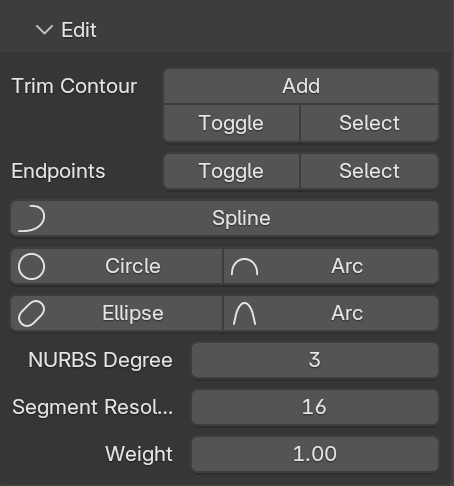

# Editing Wires
A wire is a chain of segments. To create one, in mesh editing you need to create a chain of vertices connected by edges. They represent the control points of the wire. Editing wires is then the same as editing a standard mesh plus assigning some attributes. By default, the chain represents a single Bezier segment (or a cyclic B-spline if closed).

## Editing panel
``N panel > SurfacePsycho tab > Edit section`` in edit mode, gives you access to all the wire specific actions and properties.

## Segment pie menu
Some properties are more accessible with `Shift + F` pie menu, the shortcut only works if the [SP Mode](./SP-Mode-Tool.md) is enabled (in edit mode).

## Split into segments
For your wire to have several segment, each segment must be delimited by `Endpoints`. 

### Display Endpoints
In edit mode, enabling the [SP Mode](./SP-Mode-Tool.md) tool in the left toolbar highlights vertices assigned as endpoints with black squares.

### Assign and unassign Endpoints
To assign selected vertices as endpoints, use `Shift + F` + `Drag down` or from the panel ``Endpoints > Toggle``. Both methods toggle the endpoint status, so to unassign, just do it again (the active vertex status decides which action to perform).

## Change Segment Type
Again from the pie menu or the panel, you have a all the supported segment types (all types supported by the STEP format). 
To assign a type to a segment, select it's first point and select a type. An important current limitation is that you cannot differentiate between the first and last point. The best for the moment is then to test both and undo the wrong one :/

## Change Segment resolution
Select the first point of a segment, go to the panel and change the values of `Segment Resolution` property.

## Change Segment Degree
Select the first point of a segment, go to the panel and change the values of `NURBS Degree` property. You can also change the degree from the pie menu by dragging up on ``Spline`` and use the mouse wheel to change the degree.

## Set Weight
To change the weight of control points, select them and go to the panel and change the values of `Weight` property. An important limitation is that currently an endpoint shared between two segment cannot have 2 different weights assigned.